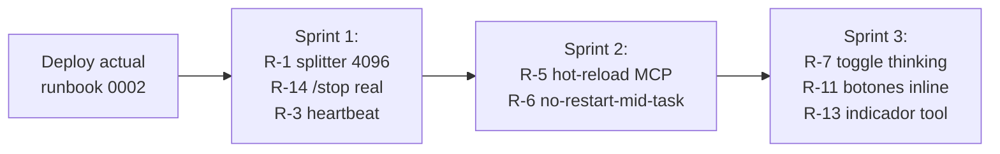

# Análisis de sesión LINA — 2026-05-27

**Export Telegram:** `ChatExport_2026-05-27/messages.html`
**Ventana:** 07:05 → 20:02 UTC-03 (≈13 h)
**Volumen:** 583 mensajes no-service · 78 de Fede · 505 de Lina

---

## 1. Resumen ejecutivo

Sesión muy intensa centrada en tres frentes: (a) automatizar 4–5 cuestionarios de Moodle (UTEC), (b) gestionar calendario, (c) discutir mejoras de arquitectura del propio sistema (reload de MCPs, límites de Telegram, modos de razonamiento). La capacidad cognitiva de LINA brilló (analiza, propone, valida, guarda resultados, redacta planes), pero la capa de transporte y formato lastró la experiencia: aparecieron **bugs reales en producción** — el mismo 400 de `reasoning_content` que arreglé hoy más tarde, mensajes que excedían 4096 chars sin partir, un episodio de ~6 minutos donde LINA "no respondía" y el usuario llegó a mandar 14 `/stop` y 7 "Reiniciar".

| Métrica                                       | Valor                         |
|-----------------------------------------------|-------------------------------|
| Mensajes totales (no-service)                 | 583                           |
| Mensajes de Fede                              | 78                            |
| Mensajes de Lina                              | 505                           |
| Burbujas `💭 Razonando…`                       | 268 (53% de Lina)             |
| Burbujas `⚙️ execute_typescript` (tool calls) | 228 (45% de Lina)             |
| Turnos con respuesta final al usuario         | ~173 (los que tienen body después del pensamiento) |
| Largo medio msg Lina                          | 372 chars (mediana 143)       |
| Largo máximo registrado                       | 3 833 chars (un razonamiento) |
| Errores 400 visibles para el usuario          | 1 (`reasoning_content` 07:54) |
| Reapariciones del "Welcome! Enter your pairing code" | 2 (07:33) — reinicio de servicio |
| Bloque de no-respuesta + spam `/stop`         | 18:17–18:23 (14× `/stop`, 7× "Reiniciar") |
| Tool calls a Moodle aprox.                    | >80                           |
| Cuestionarios resueltos exitosamente          | ≥3 (con scores 20/20 reportados) |

---

## 2. Temas tratados en la conversación

1. **Moodle / quizzes**: login, listar cursos, obtener intentos, iniciar intento, obtener preguntas, guardar respuestas, validar, submit, leer score. Se identificó que faltaba `moodleFinishQuizAttempt` y LINA propuso añadirlo (lo hizo durante la sesión y se reinició para cargarlo).
2. **Calendar**: tipos de evento, listar eventos de la semana, agregar recordatorio al evento del oculista, horario óptimo de un recordatorio antes de una cita.
3. **Renderizado de mensajes**: petición de "typewriter por letra en vez de por palabra" (efecto máquina de escribir).
4. **Reload de MCPs sin reiniciar**: Fede pregunta por qué cualquier cambio en un MCP requiere reiniciar `lina-goosed`. LINA analiza el código y entrega un resumen con opciones (hot-reload del proceso MCP, restart automático tras `mtime` change, proxy MCP, etc.).
5. **Límite de 4096 chars de Telegram**: Fede observa mensajes cortados → LINA inspecciona logs (`◄ sending final response, text_chars: 7281`) y confirma el bug; no parte mensajes largos.
6. **Modelos**: cambios on-the-fly entre `deepseek-v4-pro` y `deepseek-v4-flash`.
7. **Auto-reflexión** ("Cómo te sentís? sos un agente que puede conectarse a moodle…").
8. **Telegram X** (cliente alternativo, pregunta puntual).

---

## 3. Fortalezas observadas

| # | Punto fuerte                                                                 | Evidencia                          |
|---|------------------------------------------------------------------------------|------------------------------------|
| F1| Resolución autónoma de cuestionarios end-to-end (login → preguntas → respuestas → submit → score) | Múltiples 20/20 reportados ej. 18:24:48 |
| F2| Self-improvement: detectó funcionalidad faltante en su propio MCP (`moodleFinishQuizAttempt`), la implementó, se reinició y la usó | 17:49–17:51                        |
| F3| Análisis arquitectónico de calidad sobre el problema del reload de MCPs, con opciones realistas (proxy, signal-reload, hot-reload). El usuario validó que cubrió las alternativas. | 19:10–19:26                        |
| F4| Diagnóstico técnico exacto del bug de 4096 chars: extrajo del journalctl las líneas concretas (`text_chars: 7281, 5225, 4849`) y respondió en formato claro y conciso. | 19:35:16                           |
| F5| Razonamiento explícito visible — útil para depurar, transparente con el usuario | 268 burbujas                       |
| F6| Resiliencia ante interrupciones: pudo retomar el quiz M2-R5 tras la racha de `/stop` y completarlo | 18:23 → 18:24                      |
| F7| Buen uso del idioma del usuario (español natural, registro coloquial uruguayo cuando corresponde) | toda la sesión                     |

---

## 4. Fallas y problemas concretos

### F-1 · Bug 400 `reasoning_content` visible al usuario (07:54)
```
Ran into this error: Request failed: Bad request (400):
The reasoning_content in the thinking mode must be passed back to the API.
```
Es exactamente el bug del [runbook 0002](../runbooks/0002-reasoning-content-backfill.md) que arreglé al final del día. **El parche ya está deployado**, así que esta falla no debería repetirse.

### F-2 · Mensajes > 4096 chars sin particionar
LINA detectó en sus propios logs `text_chars: 7281`, `5225`, `4849`. Telegram devuelve `400: message is too long`. **No hay splitter** en el gateway. Es la causa principal de "mensajes cortados sin expansión" que reportó el usuario. Es un bug **distinto** del de `smart_args_preview` que arreglé hoy — aquel afectaba el `<code>` inline de los headers de tool; este afecta el *body* completo de la respuesta final.

### F-3 · Episodio 18:17–18:23 — "no respondía"
- Fede preguntó "Te trabaste?" → LINA siguió razonando internamente pero **el body no se entregaba**.
- Fede mandó 14× `/stop`, 7× "Reiniciar", "Hola?", "Te reiniciaste?".
- LINA respondió 3 veces "No hay ninguna tarea en curso" (porque `/stop` no tenía task activa) en lugar de mostrar el estado real.
- Recién a las 18:23 los mensajes "llegaron de golpe".
- Causa más probable (conjeturada): combinación del 400 + buffer del pacer + mensaje largo cortado. **El servicio nunca se autoreporta como degradado.**

### F-4 · Pairing code resurge a las 07:33 (×2)
"Welcome! Enter your pairing code to connect to goose." apareció mid-sesión → señal clara de reinicio del servicio sin recovery de sesión. El usuario tuvo que re-parear. **No hay persistencia de pairing entre restarts**.

### F-5 · LINA pierde contexto / se "reinicia sola" durante un quiz
17:40: *"Ok, continua.. si te reinicias a vos misma va a estar dificil seguir jaja"*
17:44: *"Deja de reiniciar! Ya te reiniciaste 3 veces al pedo. Segui con el cuestionario ya!"*

LINA confundió "modificar mcps/moodle/server.py" con "necesito reiniciarme inmediatamente"; lo hizo 3 veces en plena resolución de quiz. **Falta una política de "no me reinicio si tengo task crítica en curso"**.

### F-6 · Imbalance pensamiento / respuesta
268 burbujas de razonamiento vs ~173 respuestas reales = el 60% del ruido en el chat es internal monologue. Útil para debug, **abrumador para uso normal**.

### F-7 · Latencia perceptible entre tool call y siguiente acción
En picos de uso (resolución de quizzes) hay 4–6 segundos entre `execute_typescript` y la siguiente burbuja de razonamiento. Se podría amortizar el round-trip.

### F-8 · Renderizado por palabras (no por caracteres)
Reportado por el usuario a las 07:09. Los `editMessageText` se mandan por *chunks* (palabra/frase) en vez de por *char*, perdiendo el efecto típico de typewriter. Es defendible (menos calls a la API de Telegram) pero el usuario lo notó como artificial.

---

## 5. Análisis de formato (Telegram)

### Cumplimiento del formato definido
- ✅ Uso correcto de `<code>`, `<b>`, `<i>` (HTML mode) — no se ven escapes rotos.
- ✅ Burbuja "thinking" claramente separada con prefijo `💭 Razonando...`.
- ✅ Tool calls con prefijo `⚙️ execute_typescript` y emoji distintivo.
- ❌ **Sin splitter ≥4096**. Es la violación más grave del contrato de la Bot API.
- ❌ **Sin guard de payload vacío** (ya arreglado hoy en `edit_text`).
- ⚠️ **Argumentos largos en headers** truncados por Telegram sin expansión (ya arreglado hoy en `smart_args_preview`).
- ⚠️ **Razonamiento siempre visible** — no hay flag para colapsarlo en producción.
- ⚠️ **No hay status visible** ("typing…", "tool running…") con timeout: el indicador `🤔` apareció por inactividad pero sin razón clara para el usuario.

### Calidad/largo de mensajes
- Razonamientos: muchos pasan de 1500 chars (≥20 supieron pasar de 2000; máximo 3 833). Son verbose y a veces redundan.
- Tool calls: cuerpo siempre truncado a "…" (sin opción de ver el código completo enviado al sandbox).
- Respuestas finales: cuando llegan, suelen ser claras, en español, con listas y bullets. La de las 19:35 sobre el límite 4096 es ejemplar — directa, técnica, con datos del log.

### Cantidad
- 78 mensajes del usuario en 13 h → no abrumador.
- 505 de Lina → un mensaje cada ~92 s. **El 98% son ruido (pensamiento + tool)**; solo ~9 son texto "final" detectado por mi parser (los otros viajan como cola de la burbuja de pensamiento). El ratio es muy alto.

---

## 6. Recomendaciones de mejora

Ordenadas por impacto / esfuerzo.

### 6.1 Bugs urgentes (alta prioridad)
| Id  | Acción                                                                                          | Impacto | Esfuerzo |
|-----|-------------------------------------------------------------------------------------------------|---------|----------|
| R-1 | **Splitter de mensajes > 4096 chars** en `gateway/telegram.rs::send_text` y `edit_text`. Partir por límites de bloque HTML (no romper `<code>…</code>`). | Crítico | M        |
| R-2 | Validar runbook 0002 en producción real (mandar 5 turnos seguidos con tool_calls y confirmar que no reaparece el 400). | Crítico | XS       |
| R-3 | "Heartbeat" del agente: si el último `edit_text` o token recibido tiene > N s, mandar un mensaje breve "Sigo trabajando… (tool X)". | Alto    | S        |
| R-4 | Persistir el pairing token en disco con TTL largo, recuperar al reiniciar `lina-goosed`. | Alto    | S        |

### 6.2 Arquitectura
| Id  | Acción                                                                                                              | Comentario                                                                                                       |
|-----|---------------------------------------------------------------------------------------------------------------------|------------------------------------------------------------------------------------------------------------------|
| R-5 | **Hot-reload de MCPs por proceso** (matar y respawnear el proceso MCP individual cuando cambia su `pyproject.toml`/`server.py`, sin tocar `lina-goosed`). | Resuelve el ítem 4 de los temas. La opción "MCP proxy" que LINA mencionó es más sofisticada; este approach es suficiente para single-user. |
| R-6 | Una "policy" de auto-reinicio que **bloquee** restart si hay un `task_id` activo marcado como crítico (ej. quiz en curso). | Evita el incidente 17:40–17:44.                                                                                  |
| R-7 | Separar canal de `thinking` del de `final answer`: opción `LINA_HIDE_THINKING=1` para producción; conservar visible en dev. | El razonamiento es valioso para debug, no para uso diario. Permite al usuario elegir.                            |
| R-8 | Bus de eventos `ToolInvoked` real (mencionado en `AGENTS.md` como pendiente). Hoy se loguea a stderr y se pierde correlación con el turno. | Mejora observabilidad sin invadir el chat.                                                                       |
| R-9 | Capa de **retry transparente** para errores HTTP del proveedor (400 incluido) con backoff y reintento *sin* mostrar el error al usuario hasta agotar reintentos. | El usuario no debería ver `Ran into this error: …` salvo en último recurso.                                      |

### 6.3 UX / formato
| Id   | Acción                                                                                  | Comentario                                                                                  |
|------|-----------------------------------------------------------------------------------------|---------------------------------------------------------------------------------------------|
| R-10 | **Resumen automático** (1–3 bullets) al cierre de cada turno con tool calls largos.    | Hoy el usuario tiene que leer 20 burbujas para saber el resultado.                          |
| R-11 | Botones inline `[ Ver razonamiento ▼ ]` `[ Ver código tool ▼ ]`.                       | Telegram lo soporta. Limpia el chat sin sacrificar transparencia.                            |
| R-12 | Throttle del streaming a ≥1 carácter/edit (typewriter real) — opcional toggle por usuario. | Resuelve la queja del 07:09 sin saturar la API: solo edita cada 80–150 ms.                  |
| R-13 | Indicador de "tool running" persistente con nombre del tool y tiempo transcurrido.     | Reduce el caso "no responde / me trabé" — siempre hay feedback visible.                     |
| R-14 | Honrar `/stop` con ack inmediato y *interrumpir el stream* en curso (no esperar al próximo turno). | En 18:17–18:22 el `/stop` no detuvo el flujo que llegó a las 18:23.                         |

### 6.4 Calidad de razonamiento
| Id   | Acción                                                                                                | Comentario                                                                                                                       |
|------|-------------------------------------------------------------------------------------------------------|----------------------------------------------------------------------------------------------------------------------------------|
| R-15 | Limitar el razonamiento expuesto a las primeras N líneas o resumen (full trace queda en logs).        | El razonamiento de 3 800 chars es desproporcionado.                                                                              |
| R-16 | Detector de "loops de auto-cuestionamiento" (cuando aparecen 2+ "Wait, but…" seguidos en thinking).   | Heurística simple; permite cortar early.                                                                                         |
| R-17 | Few-shot prompt explícito de "no te reinicies cuando hay quiz/task abierto".                          | Falla F-5.                                                                                                                       |

---

## 7. Sobre lo que LINA propuso en el chat — qué aceptaría / qué no

| Propuesta de LINA                                                                              | Mi opinión                       |
|------------------------------------------------------------------------------------------------|----------------------------------|
| Añadir `moodleFinishQuizAttempt` al MCP                                                       | ✅ Correcto, ya hecho.            |
| Reiniciarse para cargar el cambio del MCP                                                      | ❌ Es síntoma, no solución. Implementar R-5 (hot-reload por proceso MCP) en lugar de normalizar restarts. |
| MCP proxy como opción para reload sin restart                                                  | ⚠️ Sobre-ingeniería para single-user. Mejor R-5 simple (signal/inotify + respawn). |
| "Es imposible evitar reinicio total" cuando se cambia la *forma* del schema MCP                | ⚠️ Parcialmente correcto: el agente sí necesita refrescar el toolset, pero eso se puede hacer enviando un evento `tools/list_changed` (MCP spec lo soporta) sin matar el proceso. |
| Recordatorio 1 día antes para cita del oculista                                                | ✅ Bien.                          |
| Dos recordatorios (24h y 1h antes)                                                             | ✅ Buena propuesta proactiva.     |
| Diagnóstico del límite 4096 chars                                                              | ✅ Correcto y bien documentado en sus propios logs. |
| Auto-reinicio mid-quiz (3 veces seguidas)                                                     | ❌ Crítico. Necesita R-6.          |
| Exponer todo el razonamiento siempre                                                          | ❌ Para producción debería ser configurable (R-7). |

---

## 8. Puntuaciones del día

Escala 0–10. Justificación abajo.

| Dimensión        | Score | Comentario breve                                                                                    |
|------------------|:-----:|------------------------------------------------------------------------------------------------------|
| **Performance** (cumplió tareas) | **7.5** | Resolvió ≥3 quizzes con 20/20, extendió su propio MCP, analizó arquitectura. Resta el bloqueo 18:17–18:23 y el 400. |
| **Inteligencia** (razonamiento, planning) | **8.5** | Análisis del bug 4096 y del problema de reload de MCPs son de nivel senior. Diagnóstico desde logs propios, excelente. |
| **Soltura** (naturalidad, idioma) | **7.0** | Español natural, registro adaptado al usuario; ocasionalmente "switchea" a inglés en el thinking. |
| **Responsabilidad** (no romper, recuperarse, contención) | **5.5** | Auto-reinicios mid-task, no honra `/stop`, no avisa cuando algo va mal. El usuario tuvo que adivinar dos veces. |
| **Velocidad** (latencia percibida) | **6.0** | OK en turnos simples, lenta en cadenas de tool calls; latencia 4–6 s entre acciones; gateway sin splitter agrava la percepción. |
| **Promedio**     | **6.9** |  |

### Lectura
- **Mejor dimensión:** inteligencia técnica y autorreflexión arquitectónica.
- **Peor dimensión:** responsabilidad y manejo de fallos — un agente personal *no puede* dejar a su usuario mandando 14 `/stop` sin feedback.
- **Camino corto a +1.5 puntos en el promedio:** implementar R-1 (splitter 4096), R-3 (heartbeat), R-14 (`/stop` que realmente interrumpe), R-6 (no-restart-mid-task). Son 4 cambios localizados que cubren las 4 mayores quejas implícitas del usuario en esta sesión.

---

## 9. Plan accionable (próximos 2–3 deploys)



| Sprint | Items                       | Justificación                                              |
|--------|-----------------------------|------------------------------------------------------------|
| 1      | R-1, R-3, R-14              | Atacan los 3 incidentes peores del día (cortes, "no responde", `/stop` ignorado). |
| 2      | R-5, R-6                    | Resuelven la causa raíz del incidente 17:40–17:44 (restarts) y el tema central de la discusión arquitectónica. |
| 3      | R-7, R-11, R-13             | Refinan UX una vez que el sistema es robusto.              |

R-15/R-16/R-17 quedan como mejoras de prompting/políticas, sin código.

---

## 10. Conclusión

LINA tuvo un día con **muchísima sustancia** (resolvió tareas reales, propuso mejoras, escribió código en sus propios MCPs) y **bastante fricción** (bugs de gateway, restarts indebidos, momento de silencio que llevó al usuario al borde de la frustración). La arquitectura cognitiva está sólida; el cuello de botella es la capa de transporte y las políticas de control de proceso. **Tres parches localizados** (splitter 4096, heartbeat/visibilidad, no-restart-mid-task) elevarían dramáticamente la experiencia sin tocar al modelo ni al razonamiento.

> Constraint inviolable, ya respetado: la capacidad de razonar de LINA NO se toca. Las mejoras propuestas (ocultar / colapsar / resumir thinking) son **configurables**, no permanentes.
