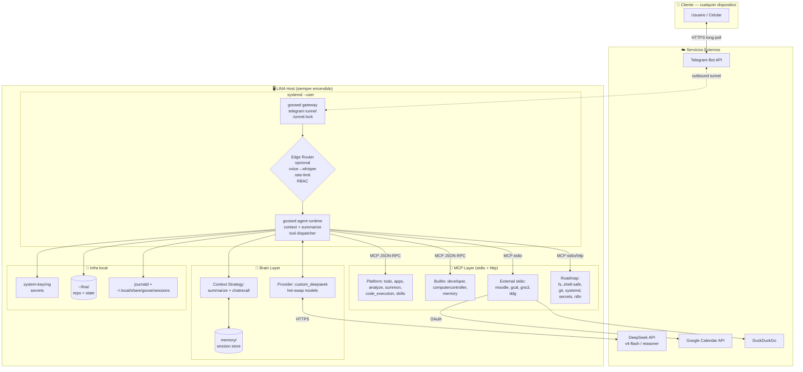

# LINA — Diseño Arquitectónico (Staff Engineer Review)

---

## 1. Auditoría del Entorno Actual

Estado real en `~/.config/goose/` (no es "Goose vanilla", ya hay infraestructura significativa):

**Runtime y provider**
- `goose` CLI: `1.35.0-canary+728d72a` en goose.
- `goosed` parcheado: goosed_patched (~280 MB) — build custom con soporte de `GOOSE_GATEWAY_MAX_TURNS` (PR #9354) y hot-swap de modelo (`goose-model`).
- Provider activo: `custom_deepseek` → `deepseek-v4-flash`. Hot-swap habilitado vía `goose-model {pro|flash|chat|reasoner}`.
- Límites: `GOOSE_MAX_TURNS=1000`, `GOOSE_GATEWAY_MAX_TURNS=200`, `GOOSE_SUBAGENT_MAX_TURNS=200`, `GOOSE_CONTEXT_STRATEGY=summarize`.

**Gateway Telegram (ya operativo)**
- Configurado en telegram.
- Pairing activo: `user_id=7966401870` (Fede), `session_id=20260525_3`, `state=paired`, `max_sessions=0` (ilimitadas).
- `tunnel.lock` presente → el gateway expone un túnel saliente (long-poll/webhook) al servicio de Telegram; **no requiere puerto público**.

**Extensiones built-in / platform habilitadas**
`todo, apps, extensionmanager, analyze, summon, summarize, tom, chatrecall, code_execution, developer, skills, computercontroller, memory`. Deshabilitadas: `orchestrator, autovisualiser, tutorial`.

**MCP servers externos (stdio) activos**
| Nombre | Cmd | Notas |
|---|---|---|
| `moodle-mcp` | `node /home/fede/moodle-mcp-server/server.js` | Local, credenciales **en texto plano dentro de `config.yaml`** ← problema de seguridad. |
| `google-calendar` | `npx -y @sudomcp/google-calendar-mcp start` | OAuth en `~/.config/google/credentials.json`. |
| `gns3` | gns3-mcp-server | Depende de disco externo `ADATA` montado → punto de fragilidad. |
| `duckduckgo-search` | `uvx duckduckgo-mcp-server` | OK. |

**Hallazgos accionables del audit**
1. **Secretos en claro** en `config.yaml` (`MOODLE_PASSWORD`, etc.) — mover a `system-keyring` (ya compilado en goosed) o a `~/.config/goose/secrets.env` con `chmod 600`.
2. **Acoplamiento a hardware local**: el MCP de GNS3 vive en un disco USB externo. Si el disco se desmonta, LINA pierde la capacidad. Hay que decidir entre (a) reubicar el venv al SSD interno, o (b) levantar GNS3-MCP como servicio remoto en el host que tenga el simulador.
3. **`goosed_patched{,2,3}` en `$HOME`** sin versionado → mover a `~/lina/bin/goosed` con symlink y registrar el SHA del PR aplicado.
4. **Sin systemd unit**: el gateway corre como proceso de sesión. Si cerrás sesión, LINA muere → ya no podés controlarla desde el celular. **Bloqueante #1 para "Jarvis".**

---

## 2. Arquitectura LINA (Telegram ↔ DeepSeek ↔ Goose ↔ MCPs)

### Decisión de diseño clave: **NO reemplazar el gateway de Goose con un bot propio**

El gateway Telegram nativo de Goose ya hace el trabajo pesado (pairing, sesiones por usuario, túnel saliente, mapping de mensajes a turnos). Construir un bot paralelo duplicaría estado y rompería el `chatrecall`. En su lugar, **se introduce una capa de "Edge Router" opcional** que solo se activa cuando se quiere lógica pre/post-LLM (rate-limit, command routing, multi-tenant, voice-notes con whisper).

### Topología



### Flujo de un turno (request lifecycle)

1. Usuario envía mensaje/voz desde Telegram.
2. Telegram entrega vía long-poll al `goosed gateway` (túnel saliente, sin puerto abierto).
3. Si es voz → Edge Router invoca `whisper` (wrapper ya configurado, CTranslate2 turbo, fallback CPU).
4. Gateway resuelve `pairing` → `session_id` → enruta a `agent runtime`.
5. Agent runtime construye el contexto (`summarize` strategy + `chatrecall` + `tom` injection) y llama a DeepSeek vía `custom_deepseek` provider.
6. DeepSeek responde con tool-calls; el agent las despacha a los MCPs vía JSON-RPC sobre stdio.
7. Resultados se reinyectan; loop hasta `GOOSE_GATEWAY_MAX_TURNS=200` o finalización.
8. Respuesta final regresa al usuario por Telegram. Sesión persiste en `~/.local/share/goose/sessions/`.

### Por qué esto da **independencia del hardware local del usuario**
- El "cliente" es Telegram, que corre en cualquier dispositivo con red.
- El "host LINA" puede ser tu PC actual, una Raspberry Pi, un VPS de USD 5/mes, o un mini-PC. Mientras el `goosed` esté vivo y autenticado a DeepSeek + MCPs, el usuario opera desde el celular.
- El túnel es **saliente** → no requiere IP pública, no requiere abrir puertos, atraviesa NAT/CGNAT.

---

## 3. Estructura del Repositorio LINA

### Localización física: `~/lina/`

**Justificación técnica** (no es arbitrario):

| Opción | Veredicto |
|---|---|
| `~/lina/` ✅ | Goose corre como `fede`, ya tiene HOME mapeado, los MCPs stdio resuelven paths relativos al `cwd` del proceso padre. Cero fricción con `developer` y `computercontroller` que necesitan escribir en HOME. |
| `/opt/lina/` ❌ | Requeriría `sudo` para el daemon; rompe el modelo `--user` de systemd; el MCP `developer` perdería acceso natural a `~/Documents`, `~/IdeaProjects`, etc. |
| `/srv/lina/` ❌ | Mismo problema; además los OAuth tokens viven en `~/.config/google/`. |
| `~/IdeaProjects/lina/` ❌ | Mezcla el agente con código de cliente (`terotech-proyecto-sinep`). LINA debe estar en su propio raíz para que `analyze`/`skills` no se confundan. |

**Regla**: el agente vive en `~/lina/`, pero **NO mueve** `~/.config/goose/` ni `~/.local/share/goose/` — Goose seguirá usando XDG. El repo solo contiene **código, recetas, MCPs propios, infraestructura y scripts de bootstrap**; el estado runtime queda en XDG.

### Árbol propuesto

```
~/lina/                              # git repo raíz (GitHub: federicocarluccio/lina)
├── README.md
├── AGENTS.md                        # convenciones para el propio Goose
├── .env.example                     # NUNCA committear .env real
├── .gitignore                       # excluir state/, secrets/, *.session
├── pyproject.toml                   # workspace Python (uv)
├── Cargo.toml                       # workspace Rust (para MCPs nativos)
├── justfile                         # tareas: bootstrap, start, stop, logs, doctor
│
├── bin/
│   ├── goosed                       # symlink → ../vendor/goosed-<sha>
│   ├── lina                         # CLI wrapper (start/stop/status/logs)
│   └── lina-doctor                  # healthcheck de MCPs y provider
│
├── vendor/
│   └── goosed-728d72a               # binario versionado por SHA
│
├── config/
│   ├── goose.config.yaml.tmpl       # plantilla; render con envsubst
│   ├── mcp-registry.yaml            # fuente de verdad de qué MCPs cargar
│   └── secrets.env.example          # KEYRING_SERVICE, DEEPSEEK_API_KEY, …
│
├── mcps/                            # MCPs DESARROLLADOS por LINA
│   ├── fs-safe/                     # filesystem con allowlist + audit log
│   │   ├── pyproject.toml
│   │   └── src/lina_fs_safe/
│   ├── shell-policy/                # shell con jails y dry-run
│   ├── systemd-user/                # control de servicios --user
│   ├── secrets/                     # interfaz al keyring
│   ├── git-ops/                     # clonar/commit/PR vía gh
│   └── self-modify/                 # mcp para que LINA genere otros mcps
│
├── domain/                          # CORE — sin dependencias de infra
│   ├── entities/                    # Task, Skill, Capability, Pairing
│   ├── policies/                    # RBAC, rate-limit, cost-cap
│   └── events/                      # TaskRequested, ToolInvoked, …
│
├── application/                     # CASOS DE USO
│   ├── orchestration/               # planning loops, retries
│   ├── routing/                     # text→intent→agent/subagent
│   ├── memory/                      # estrategia de retención
│   └── self_extension/              # workflow "crear nuevo MCP"
│
├── infrastructure/                  # ADAPTADORES
│   ├── providers/deepseek/          # cliente, retry, cost meter
│   ├── gateway/telegram/            # hooks pre/post (whisper, RBAC)
│   ├── persistence/                 # sqlite/duckdb para state + costs
│   └── observability/               # tracing, prom metrics
│
├── recipes/                         # Goose recipes (.yaml) reutilizables
│   ├── gns3-build-topology.yaml
│   ├── moodle-weekly-digest.yaml
│   └── new-mcp-scaffold.yaml        # ← meta-receta: LINA crea MCPs
│
├── skills/                          # SKILL.md cargados por extensión `skills`
│   ├── deepseek-cost-optimization/
│   ├── mcp-authoring/
│   └── gns3-cisco-best-practices/
│
├── prompts/
│   ├── system/lina.md               # identidad y políticas
│   └── tom/                         # mensajes Top-Of-Mind por contexto
│
├── deploy/
│   ├── systemd/
│   │   ├── lina-goosed.service      # unit --user
│   │   └── lina-gateway.service
│   ├── docker/                      # opcional: imagen para VPS
│   └── ansible/                     # provisioning de un host nuevo
│
├── tests/
│   ├── unit/                        # domain + application
│   ├── integration/mcps/            # cada MCP contra un harness
│   └── e2e/telegram/                # bot test account
│
└── docs/
    ├── architecture/
    │   ├── 0001-clean-architecture.md   # ADR
    │   ├── 0002-event-driven-mcps.md
    │   └── 0003-self-extension.md
    └── runbooks/
```

### Vínculo con el estado runtime de Goose

```
~/.config/goose/config.yaml   → generado a partir de ~/lina/config/goose.config.yaml.tmpl
~/.config/goose/gateway/       → propiedad de goosed (NO tocar a mano)
~/.local/share/goose/sessions/ → backups periódicos vía ~/lina/bin/lina backup
```

Un cambio en `~/lina/config/mcp-registry.yaml` → `just apply-config` → re-render del `config.yaml` → `systemctl --user reload lina-goosed`.

---

## 4. Roadmap de MCP Servers + Patrón Arquitectónico

### Patrón: **Clean Architecture + Event-Driven entre MCPs**

- **Clean Architecture** dentro de cada MCP y dentro del core de LINA: `domain` → `application` → `infrastructure`. Esto permite que LINA (la propia IA) genere un MCP nuevo siguiendo un template determinístico (la meta-receta `recipes/new-mcp-scaffold.yaml`).
- **Event-Driven** entre MCPs: cada tool-call publica un evento (`ToolInvoked`, `TaskCompleted`, `CostIncurred`) en un bus local (NATS embebido o Redis Streams o `sqlite + LISTEN`). Permite:
  - Auditoría sin acoplar los MCPs entre sí.
  - Que MCPs reactivos (ej. `notifier`) se suscriban sin que el llamador los conozca.
  - Replay para debugging y para entrenar recipes.

### Ola 1 — **Soberanía sobre el host** (semanas 1-2)
Sin esto LINA es "un chatbot bonito". Es la base de "Jarvis".

| # | MCP | Por qué primero |
|---|---|---|
| 1 | **`fs-safe`** | Filesystem con allowlist (`~/lina`, `~/Documents`, `~/IdeaProjects`), audit log, dry-run. Sustituye al `developer` para escritura masiva sin matar todo HOME. |
| 2 | **`shell-policy`** | Ejecuta comandos con perfiles (`safe`, `sudo-requires-otp`, `network-only`). Mata el riesgo del `developer` puro. |
| 3 | **`secrets`** | Wrapper sobre `system-keyring`. Elimina los passwords en `config.yaml`. |
| 4 | **`systemd-user`** | LINA puede arrancar/parar/ver logs de sus propios servicios y MCPs. Es como darle "manos" sobre sí misma. |

### Ola 2 — **Auto-extensión** (semanas 3-4)
Habilita que LINA cree nuevas capacidades sin tu intervención.

| # | MCP | Capacidad desbloqueada |
|---|---|---|
| 5 | **`git-ops`** (gh-cli wrapper) | Clonar, branch, commit, PR. Versionar recipes y MCPs nuevos. |
| 6 | **`self-modify`** | Scaffold de MCPs vía template + `cargo`/`uv`. Registra el nuevo MCP en `mcp-registry.yaml` y solicita reload. |
| 7 | **`cost-meter`** | Mide tokens DeepSeek por tarea → cap diario, alertas, sugerencia de model hot-swap a `flash` cuando se infla. |
| 8 | **`notifier`** | Telegram outbound proactivo (no solo respuestas) — recordatorios, alertas, fin de tareas largas. |

### Ola 3 — **Productividad personal** (semanas 5-6)

| # | MCP | Uso |
|---|---|---|
| 9 | **`obsidian`** o **`markdown-vault`** | Memoria de largo plazo navegable por humano. |
| 10 | **`http-fetch`** + **`browser-headless`** (Playwright) | Sustituye DDG para tareas web reales. |
| 11 | **`gmail`** / **`imap`** | Triage de correo. |
| 12 | **`n8n-bridge`** | LINA dispara workflows complejos existentes en n8n en vez de reimplementarlos. |

### Ola 4 — **Inteligencia operativa** (mes 2+)

| # | MCP | Uso |
|---|---|---|
| 13 | **`docker`** / **`podman`** | Levantar sandboxes para código no confiable que LINA genera. |
| 14 | **`metrics`** (Prometheus) | Self-monitoring del propio host. |
| 15 | **`gns3-remote`** | Reescribir el actual para hablar HTTP al GNS3 server en otra máquina → independencia del disco ADATA. |
| 16 | **`rag-local`** (LanceDB + bge-m3) | Memoria semántica sobre documentos del usuario. |

### Convención técnica para todo MCP del repo

```
mcps/<nombre>/
├── pyproject.toml | Cargo.toml
├── src/lina_<nombre>/
│   ├── domain/        # tipos + invariantes
│   ├── application/   # casos de uso (1 archivo por tool)
│   ├── infrastructure/# I/O real
│   └── server.py      # bind MCP stdio → application
├── policies/<nombre>.policy.yaml   # capacidades, rate-limits
└── tests/
```

Cada herramienta MCP **emite un evento** al final (`ToolInvoked{tool, args_hash, duration_ms, cost_estimate, success}`). El `cost-meter` y el `notifier` solo se suscriben — no hay acoplamiento.

---

## 5. Gap Analysis — ¿Qué tan lejos estás de "Jarvis"?

**Veredicto honesto: estás al ~25-30 % del camino.** Tenés la espina dorsal (Goose + DeepSeek + Telegram + 3 MCPs), pero te faltan las capas que distinguen un "chatbot con tools" de un "sistema operativo autónomo".

### Brechas críticas, en orden de bloqueo

**1. Persistencia y disponibilidad del proceso — BLOQUEANTE**
- Hoy: `goosed` corre como proceso de sesión. Sin systemd unit, si reiniciás el host o cerrás sesión gráfica → LINA muerta → perdés el control remoto. Un Jarvis que se apaga cuando dormís no es Jarvis.
- Fix: `deploy/systemd/lina-goosed.service` con `Restart=on-failure`, `loginctl enable-linger fede`.

**2. Seguridad / Manejo de secretos — ALTO**
- Hoy: `MOODLE_PASSWORD: Energ1asRenovables.` en texto plano en `config.yaml` versionable. OAuth de Google en disco sin envolver.
- Fix: MCP `secrets` (Ola 1) + `chmod 600` + integrar `system-keyring` que ya está compilado en tu goosed_patched.

**3. Autenticación y RBAC del gateway — ALTO**
- Hoy: pairing único `user_id=7966401870`. Si alguien comprometiera tu Telegram, tiene shell completo sobre tu HOME vía `developer`.
- Fix: política multi-nivel en Edge Router: comandos peligrosos (`shell-policy` perfil sudo, `fs-safe` fuera de allowlist) requieren OTP confirmación en un segundo mensaje. Lista de tools por rol.

**4. Manejo de contexto con DeepSeek — MEDIO-ALTO**
- DeepSeek-v3/v4 tiene 64-128 K de contexto, pero tu `GOOSE_MAX_TURNS=1000` + `GATEWAY_MAX_TURNS=200` puede explotar costo y degradar precisión. `summarize` ayuda pero pierde detalle de tool-calls.
- Fix: estrategia híbrida — `summarize` para mensajes, **preservar verbatim los últimos N tool-call results**; mover lo viejo a `chatrecall` (RAG sobre sesiones). Implementar `cost-meter` (Ola 2) con hot-swap automático: planning con `reasoner`, ejecución con `flash`.

**5. Cost governance — MEDIO**
- Sin medición → un loop tonto de 200 turnos con `reasoner` puede costar varios dólares en minutos.
- Fix: `cost-meter` MCP + cap diario en `config/policies.yaml` + alerta Telegram al 80 %.

**6. Estado y memoria de largo plazo — MEDIO**
- `memory` builtin es key-value plano. `chatrecall` busca en sesiones. No hay grafo de hechos del usuario, ni memoria semántica.
- Fix: Ola 4 `rag-local` (LanceDB + bge-m3) + esquema de "facts" en SQLite (preferencias, contactos, proyectos activos).

**7. Auto-extensión real — MEDIO**
- Hoy LINA puede *escribirte* el código de un MCP nuevo, pero vos lo instalás. Eso no es autónomo.
- Fix: Olas 1-2 completas (`fs-safe` + `git-ops` + `self-modify` + `systemd-user`). Recipe `new-mcp-scaffold.yaml` que: scaffolds → `cargo build`/`uv sync` → registra en `mcp-registry.yaml` → `systemctl --user reload`.

**8. Independencia de hardware específico — MEDIO**
- MCP GNS3 en `/media/fede/ADATA/...` → desmontás el disco y pierdes la capacidad.
- Fix: dockerizar `goosed` + MCPs Python; mover GNS3 a un servicio HTTP. El bonus es que podés migrar a un VPS sin perder estado.

**9. Observabilidad — MEDIO-BAJO**
- `journald` y `sessions/` no son suficientes para debuggear un loop agéntico.
- Fix: OpenTelemetry traces por turno + métricas Prom (`tokens_in`, `tokens_out`, `tool_latency`, `tool_errors`).

**10. Proactividad — BAJO pero define "Jarvis"**
- LINA hoy es reactiva: solo actúa cuando le hablás.
- Fix: scheduler (`systemd timers` o APScheduler) que dispara recipes en eventos (calendario, cron, webhooks). El MCP `notifier` cierra el loop hablándote vos primero.

**11. Sandbox de código generado — BAJO ahora, crítico cuando crezca**
- Si LINA genera y ejecuta código Python sin aislamiento, una alucinación = `rm -rf`.
- Fix: `docker`/`podman` MCP (Ola 4) o `bubblewrap`/`firejail` en `shell-policy`.

**12. Multi-usuario / multi-agente — FUTURO**
- `max_sessions=0` permite sesiones ilimitadas pero hay un solo pairing. Para "LINA as a service" necesitás separar identidades y políticas por usuario.

### Síntesis priorizada

| Bloque | Costo de implementación | Desbloquea |
|---|---|---|
| systemd unit + linger | 1 tarde | 24/7 real |
| MCP `secrets` + migración | 1 día | seguridad, repo público |
| MCPs `fs-safe` + `shell-policy` + `systemd-user` | 1 semana | autonomía sobre el host con red de seguridad |
| `cost-meter` + hot-swap policy | 2 días | costo previsible |
| `git-ops` + `self-modify` + meta-receta | 1 semana | auto-extensión real ← el salto cualitativo |
| OTel + dashboards | 3 días | poder operar el sistema cuando falle |
| RAG local + facts graph | 2 semanas | memoria que un Jarvis necesita |

Hechos esos siete bloques estás en ~70-75 % de Jarvis. El último 25 % es proactividad fina, multi-modal serio (visión, no solo voz), y planificación multi-step robusta — territorio donde DeepSeek-reasoner todavía no es Claude/GPT-5, así que vale la pena dejar el provider abstracto para hacer A/B sin tocar el resto.