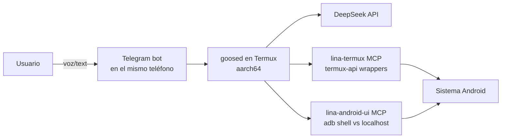
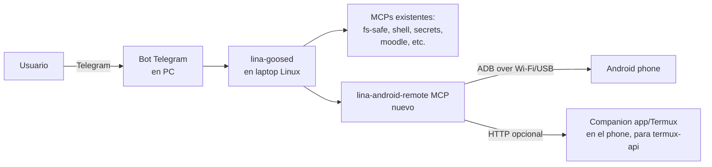
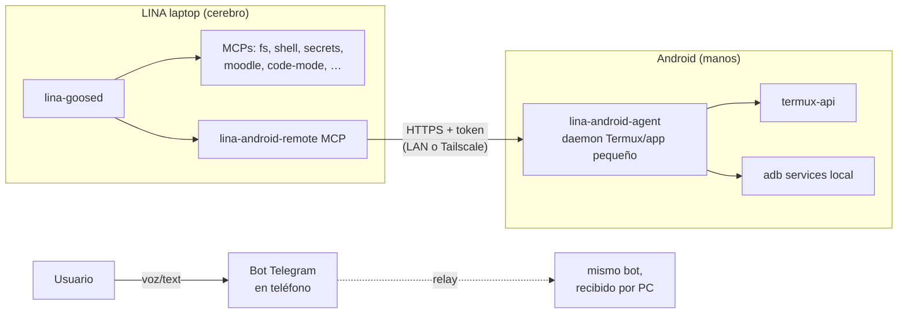
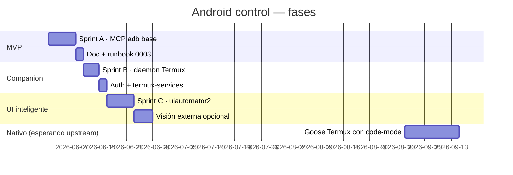

# ADR 0002 — LINA en Android: arquitectura para control de celular

**Fecha:** 2026-05-27
**Estado:** Propuesta — pendiente decisión
**Tema disparador:** sesión 2026-05-27 ([review](../analysis/2026-05-27-session-review.md)) — Fede quiere darle a LINA "full control" del celular igual que del laptop: abrir apps, buscar en internet, reservar pasajes, recordatorios contextuales, voz.
**Constraints heredados:**
- LINA ya corre en Linux con DeepSeek V4 + 5 MCPs propios + Telegram gateway.
- Razonamiento DeepSeek queda ON (constraint inviolable del usuario).
- Secretos vía MCP `secrets`, jamás en config.

---

## 1. Objetivo

Que LINA pueda **operar el celular Android** del usuario con el mismo nivel de control y autonomía que ya tiene en el laptop:

| Capacidad           | Ejemplo de tarea                                                                 |
|---------------------|----------------------------------------------------------------------------------|
| Apertura de apps    | "Abrime WhatsApp y mostrame el chat con mamá"                                    |
| Web/browser         | "Buscá en Google el horario del oculista mañana"                                 |
| Compra / reservas   | "Reservame un pasaje de Buenos Aires a Madrid el 12 de julio (más barato)"       |
| Sensores / sistema  | "Subí el brillo al 80% y poné el modo no-molestar hasta las 8"                   |
| Mensajería          | "Mandale por Telegram a Juan 'llego en 15'"                                      |
| Voz                 | Comandos por nota de voz (TTS de respuesta opcional)                             |
| Background / proact.| "Avisame cuando Carolina mande un mensaje" (push automático)                     |

---

## 2. Estado del arte (investigado 2026-05-27)

### 2.1 Goose en Android — confirmado pero con caveat
- ✅ **PR [block/goose#3890](https://github.com/aaif-goose/goose/pull/3890)** merged 2025-08-28 — añade soporte explícito de "linux computer control for android (termux)".
- ✅ Documentado en `BUILDING_LINUX.md` del repo Goose; build instructions oficiales para Termux/aarch64.
- ⚠️ **No hay binario prebuilt oficial** ([issue #6592](https://github.com/aaif-goose/goose/issues/6592), cerrado *won't fix*). Hay un prebuilt no-oficial en [`shawn111/goose/releases/tag/termux`](https://github.com/shawn111/goose/releases/tag/termux).
- ❌ **Bloqueador serio para nuestro caso**: el feature `code-mode` (que usamos para `execute_typescript`) depende de `v8-goose` → `librusty_v8_release_aarch64-linux-android.a.gz` → **HTTP 404** en deno releases. Reportado hace 5 días, sin fix upstream.
  → Si compilamos Goose en Termux **hay que excluir `code-mode`**, perdemos el tool central que LINA usa hoy para todo. Habría que migrar a un sandbox alternativo o esperar al fix upstream de rusty_v8.

### 2.2 Control del Android desde Linux (sin app en el teléfono)
- **ADB sobre Wi-Fi** (`adb connect <ip>:5555`) — requiere Wireless Debugging activado en Developer Options. Funciona sin root.
  - `adb shell am start -n <pkg>/<activity>` — abrir apps.
  - `adb shell input tap X Y` / `input text "..."` / `input keyevent KEYCODE_ENTER` — controlar UI.
  - `adb shell uiautomator dump` → XML del view tree → parseable por LINA.
  - `adb exec-out screencap -p > shot.png` — screenshot (útil para visión).
- **scrcpy** — mirror/control del teléfono desde PC vía USB/Wi-Fi. Excelente para humano-controla-teléfono pero **no es programable** por agente; sirve para debug y para que el usuario *vea* lo que LINA hace.
- **UiAutomator2** (Python) — wrapper de alto nivel sobre ADB con XPath para elementos UI. Mejor que `input tap` raw.
- **Frida + objection** — instrumentación dinámica; potente pero invasivo y normalmente disparador de detección de fraude en apps de pago/banca.

### 2.3 Capacidades nativas en el teléfono (Termux + termux-api)
[`termux-api`](https://wiki.termux.com/wiki/Termux:API) es la pieza clave para acceso a APIs Android desde shell:

| Comando termux-api          | Capacidad                                |
|-----------------------------|------------------------------------------|
| `termux-notification`       | Crear/cancelar notificaciones            |
| `termux-sms-send` / `-list` | SMS (requiere permiso)                   |
| `termux-contact-list`       | Contactos                                |
| `termux-location`           | GPS                                      |
| `termux-clipboard-get/set`  | Portapapeles                             |
| `termux-camera-photo`       | Foto                                     |
| `termux-microphone-record`  | Audio                                    |
| `termux-tts-speak`          | Text-to-speech                           |
| `termux-telephony-call`     | Llamadas                                 |
| `termux-volume`/`brightness`| Sistema                                  |
| `termux-share`              | Intent share                             |
| `termux-toast`              | Toast UI                                 |

⚠️ **No permite** controlar UI de apps de terceros (para eso → ADB/UIAutomator).

### 2.4 Frameworks de agentes mobile (state-of-the-art)
- **AppAgent / MobileAgent / Mobile-Agent-v2** — papers académicos: LLM ve screenshot, decide click/swipe, ADB ejecuta. Muy maduro técnicamente, pero requiere **modelo con visión** (GPT-4V, Claude Sonnet, Qwen-VL). DeepSeek V4 *no* es multimodal aún.
- **Tasker + AutoInput** — automatización clásica Android; no es agéntica per se, pero LINA podría disparar tasks vía intent.
- **droidrun** / **autodroid** — research projects open-source de 2025.

### 2.5 Modelo de IA en el teléfono
- **DeepSeek API** funciona perfectamente desde Termux/Android (sólo es HTTPS). No hay diferencia con Linux.
- **Modelos locales** en celular: `llama.cpp` en Termux corre Qwen 2.5 3B / Phi-3-mini en Snapdragon 8 Gen 2+; útil sólo como offline-fallback, no como cerebro principal.

---

## 3. Tres arquitecturas posibles

### Opción A — LINA corre en el teléfono (Termux nativo)

- **Pros:** sin dependencia de PC, funciona en cualquier lado, latencia mínima.
- **Contras:** sin `code-mode` (404 rusty_v8) → pierde la herramienta central; batería; storage; performance limitada; sin acceso a los MCPs Linux actuales (fs-safe, shell-policy, etc.).

### Opción B — LINA queda en el PC, controla el teléfono remoto

- **Pros:** reutiliza todo lo que ya hay; mantiene `code-mode`; CPU y RAM del laptop; secretos centralizados; un solo punto de configuración.
- **Contras:** PC tiene que estar prendido y conectado; teléfono tiene que ser alcanzable (mismo Wi-Fi o Tailscale); latencia adicional para acciones UI; ADB se desconecta a veces.

### Opción C — Híbrido: cerebro en PC, *agente sombra* en el celular

- **Pros:** combina lo mejor de A y B. El agente en el celular es *tonto* (sólo expone capabilities); el cerebro y el contexto viven en el PC. Si el PC está apagado, el celular puede fallback a un modo "comandos rápidos" con un modelo local pequeño.
- **Contras:** dos componentes a mantener; algo más complejo de empacar; requiere Tailscale o LAN común.

---

## 4. Recomendación

**Opción C (Híbrido)** para producción, con un **subset de Opción B** en MVP.

Razones:
1. Conserva `code-mode` y el resto del stack actual de LINA — no rompemos nada.
2. El "celular" se vuelve un *MCP servidor* más, igual que `fs-safe` o `shell-policy`. La arquitectura encaja con `AGENTS.md`.
3. Permite migrar al modo nativo (Opción A) en el futuro sin reescribir.
4. Tareas tipo "reservar pasajes" se pueden resolver con **APIs** (Skyscanner, Booking, Aerolíneas) — no necesitan UI scraping. La capa Android queda para lo *que sólo se puede hacer ahí* (apps propietarias, notificaciones del sistema, llamadas).

---

## 5. Componentes a construir

### 5.1 Nuevo MCP `lina-android-remote` (lado PC)
Idéntica estructura Clean Arch a los otros MCPs:
```
mcps/android-remote/
├── pyproject.toml
└── src/lina_android_remote/
    ├── server.py
    ├── domain/
    │   └── entities.py        # AndroidDevice, UiNode, Intent
    ├── application/
    │   └── use_cases.py       # OpenApp, TypeText, TakeScreenshot, …
    └── infrastructure/
        ├── adb_client.py      # subprocess wrapper (ADB over Wi-Fi)
        ├── ui_automator.py    # uiautomator2 client
        └── companion_http.py  # cliente del daemon en el phone
```

**Tools expuestos:**
| Tool                          | Descripción                                            | Backend             |
|-------------------------------|--------------------------------------------------------|---------------------|
| `androidOpenApp(package)`     | Lanza app por package name                             | adb am start        |
| `androidListInstalledApps()`  | Lista de packages                                      | adb pm list         |
| `androidTap(x, y)` / `Swipe`  | Tap/swipe en coords                                    | adb input           |
| `androidTypeText(s)`          | Tipea (escape unicode)                                 | adb input text      |
| `androidKey(name)`            | KEYCODE_BACK/HOME/ENTER/…                              | adb input keyevent  |
| `androidUiDump()`             | Árbol UI XML como JSON                                 | uiautomator2         |
| `androidFindElement(query)`   | Selector por text/desc/resource-id                     | uiautomator2         |
| `androidScreenshot()`         | PNG base64 (futuro: para modelo de visión)             | adb screencap       |
| `androidNotify(title, body)`  | Notificación nativa                                    | companion termux-api|
| `androidTts(text)`            | Hablar en voz alta                                     | companion termux-api|
| `androidLocation()`           | GPS                                                    | companion termux-api|
| `androidClipboardGet/Set`     | Portapapeles                                           | companion termux-api|
| `androidSendIntent(action, …)`| Intent genérico (compartir, dialer, etc.)              | adb am              |

Política `shell-policy` ya existente protege esto: cada tool emite `ToolInvoked` para auditoría; operaciones tipo `androidSendSms` requieren confirmación humana.

### 5.2 Companion daemon en el teléfono (`lina-android-agent`)
- Termux + Python (FastAPI o aiohttp), un único script.
- Escucha en `127.0.0.1:7777` (o por Tailscale 100.x.x.x:7777).
- Auth: token bearer fijo guardado en el MCP `secrets` del PC.
- Endpoints 1:1 con los wrappers `termux-api`.
- Auto-start vía `termux-services` (`sv-enable lina-android-agent`).
- Persistencia con `termux-wake-lock` para que no lo mate Doze cuando la pantalla está apagada.

### 5.3 Bot de Telegram en el celular (opcional, fase 3)
Como hoy ya hablás con LINA por Telegram desde el celular, **no hace falta cambiar nada**: el mismo bot funciona estés donde estés. La novedad es que LINA puede *ejecutar acciones en el celular* aunque vos le hables desde la cama por voz.

---

## 6. Paso a paso — Usuario (Fede)

> Requisitos: Android 8+, Wi-Fi compartido con el PC (o Tailscale), 1 GB libre.

### Fase 1 — habilitar acceso (15 min)
1. **Developer Options:** Ajustes → Acerca del teléfono → tocar 7 veces "Número de compilación".
2. **Wireless Debugging:** Ajustes → Opciones de desarrollador → Depuración inalámbrica → On.
3. **Vincular** con código (te muestra IP:puerto y código de 6 dígitos):
   - En el PC: `adb pair <ip>:<port>` → ingresá el código.
   - Después: `adb connect <ip>:5555`.
4. **Test:** `adb devices` debe listar el teléfono.

### Fase 2 — instalar el agente (15 min)
5. Instalar **Termux** y **Termux:API** desde F-Droid (no Play Store — la versión de Play está desactualizada).
6. En Termux:
   ```bash
   pkg update && pkg upgrade -y
   pkg install -y python termux-api termux-services openssh
   pip install fastapi uvicorn[standard]
   ```
7. (Opcional) Instalar Tailscale en el teléfono y unirlo a tu tailnet — así LINA llega al teléfono incluso fuera de casa.
8. Descargar el agente:
   ```bash
   git clone https://github.com/<tu-fork>/lina-android-agent ~/lina-agent
   cd ~/lina-agent && bash install.sh
   ```
9. El instalador te muestra un **token bearer** (UUID); copialo.

### Fase 3 — registrar el token en LINA
10. En el PC, desde el chat de Telegram con LINA, decile:
    > "Guardá este secreto: service `android-agent`, key `bearer`, value `<token>`. Y el host del teléfono es `<ip o tailnet>`."
11. LINA llama al MCP `secrets` y al MCP `config` (futuro) para guardar `android.host` y `android.bearer`.
12. Reiniciar `lina-goosed` (o, cuando esté implementado el hot-reload, simplemente avisarle).

### Fase 4 — uso
13. Probá:
    > "LINA, ¿qué apps tengo instaladas que empiecen con 'wh'?"
    > "Abrime Spotify y pasá a la siguiente canción."
    > "Mandame al portapapeles del teléfono mi último password de UTEC."

Si todo va bien, podés delegar tareas más complejas:
> "Buscame en Skyscanner pasajes BUE→MAD para el 12 de julio, vuelta el 26, mostrame los 3 más baratos y esperá que te confirme antes de reservar."

---

## 7. Paso a paso — Desarrollador

### MVP (Sprint A · ~1 semana de trabajo)
1. **Repo nuevo o subcarpeta `mcps/android-remote/`** con la estructura de §5.1.
2. **Implementar 6 tools mínimos**: `OpenApp`, `ListApps`, `Tap`, `TypeText`, `Key`, `UiDump`. Todo via `adb` subprocess; sin companion todavía.
3. **Wiring:**
   - Añadir entrada en `config/mcp-registry.yaml`.
   - Añadir paths permitidos para shell-policy: `adb`, `scrcpy`.
   - Añadir secreto `android.adb_host` (default `127.0.0.1:5555`).
4. **Tests:**
   - `tests/integration/mcps/test_android_remote.py` con un emulador (`avdmanager` + `emulator -no-window`) en GitHub Actions.
   - Caso happy-path: open Settings, tap, dump, assert.
5. **Doc:** `docs/runbooks/0003-android-control-setup.md` con el quickstart.

### Companion daemon (Sprint B · ~3 días)
6. Repo `lina-android-agent` con FastAPI + termux-api wrappers (~150 LoC).
7. `install.sh` que:
   - Genera token UUID.
   - Crea servicio `termux-services` (`sv up lina-android-agent`).
   - Imprime token + IP.
8. Endpoints `/notify`, `/tts`, `/location`, `/clipboard`, `/sms` (con flag `--require-confirm`).
9. Lado MCP: nueva clase `CompanionHttpClient` con timeout y retry.

### UI inteligente (Sprint C · ~1 semana)
10. Integrar `uiautomator2` (Python lib) en el MCP — selectores por texto/resource-id en vez de coords.
11. Tool `androidFindElement(query)` → devuelve bounds + click.
12. (Opcional) Tool `androidScreenshot()` — guardado en `fs-safe` para que LINA lo describa con un modelo de visión externo (no DeepSeek).

### Cuando rusty_v8 publique Android (futuro)
13. Reabrir la opción A: compilar `goose` en Termux con `code-mode` activo, así LINA puede correr 100% en el teléfono si te llevás solo el celular.

---

## 8. Seguridad

| Riesgo                                    | Mitigación                                                                                     |
|-------------------------------------------|------------------------------------------------------------------------------------------------|
| ADB inalámbrica expuesta a la LAN         | Tailscale + ACLs; o `adb` solo sobre USB cuando estás en la casa; nunca puerto 5555 abierto al exterior. |
| Token del companion robado                | TTL + rotación; firmar con MAC + timestamp; rate-limit en el daemon.                            |
| LINA ejecuta acciones costosas (pagos)    | Política `confirmRequired` en `shell-policy`-equivalente del MCP android para `androidSendIntent` con scheme `tel:`, `mailto:`, formularios de pago, etc. |
| Notificaciones / SMS spam                 | Cuota diaria; whitelist de destinatarios para `SendSms`.                                       |
| App de banca detecta automation           | Evitar usar UI scraping para apps de pago; preferir APIs oficiales (open banking, MercadoPago API). |
| Geolocalización filtrada                  | `androidLocation` requiere flag `purpose` y se loguea.                                         |

---

## 9. Lo que NO recomiendo

| Idea                                                  | Por qué no                                                              |
|-------------------------------------------------------|-------------------------------------------------------------------------|
| Compilar Goose en Termux **sin** `code-mode`          | Pierde el tool central; refactor masivo del resto de MCPs.              |
| Reemplazar el bot de Telegram por una app Android propia | Telegram ya funciona en todos lados; mantener dos UIs duplica esfuerzo.  |
| Tasker como capa de orquestación                      | No es agéntico; es disparador por reglas. LINA es el orquestador.       |
| Frida / hooking para apps de banca                    | Bloqueo / suspensión de cuenta; legal/ético dudoso.                     |
| Modelo local en el celular como cerebro principal     | DeepSeek V4 supera por orders-of-magnitude lo que corre en SoC mobile.  |
| Reemplazar DeepSeek por un modelo con visión          | Pérdida de calidad de razonamiento. Mejor: añadir visión *en paralelo* sólo cuando el tool lo necesita (screenshot → Gemini Flash → texto → DeepSeek). |

---

## 10. Roadmap propuesto



| Fase | Entregable                                                                | Valor para Fede                                                                         |
|------|---------------------------------------------------------------------------|-----------------------------------------------------------------------------------------|
| MVP  | Abrir apps, tap/type/key, dump UI por ADB                                | "LINA abrime esto, escribime aquello" — control básico                                  |
| Comp | Notificaciones, TTS, clipboard, location, SMS                            | Acciones nativas Android, no sólo UI scraping                                            |
| UI++ | Selectores semánticos, opcional screenshot→visión                        | "Bookeame esto, encontrá el botón X" — autonomía real                                   |
| Nat  | Goose corriendo dentro del teléfono                                       | Independencia del PC; offline parcial; portabilidad                                      |

---

## 11. Decisiones abiertas

1. **Transport companion ↔ PC**: ¿Tailscale (más seguro, requiere cuenta) o LAN directa (más simple, menos portable)?
2. **uiautomator2 vs raw ADB**: el primero requiere instalar un APK helper (`atx-agent`). ¿Vale el costo?
3. **Visión**: ¿integrar Gemini Flash / Claude Sonnet sólo para screenshot? Costo extra pero abre apps complejas (Uber, Rappi, banca).
4. **Privacidad**: ¿qué auditoría queremos? Mi propuesta: cada tool emite `ToolInvoked` al bus (cuando exista) y se persiste 30 días en `~/.local/share/lina/audit.jsonl`.

---

## 12. Referencias

- Goose Termux merged PR: https://github.com/aaif-goose/goose/pull/3890
- Goose Android binary issue: https://github.com/aaif-goose/goose/issues/6592
- Termux:API: https://wiki.termux.com/wiki/Termux:API
- uiautomator2: https://github.com/openatx/uiautomator2
- AppAgent (paper): https://arxiv.org/abs/2312.13771
- Mobile-Agent-v2: https://github.com/X-PLUG/MobileAgent
- ADB over Wi-Fi: https://developer.android.com/tools/adb#wireless
- scrcpy: https://github.com/Genymobile/scrcpy
- Tailscale Android: https://tailscale.com/download/android
