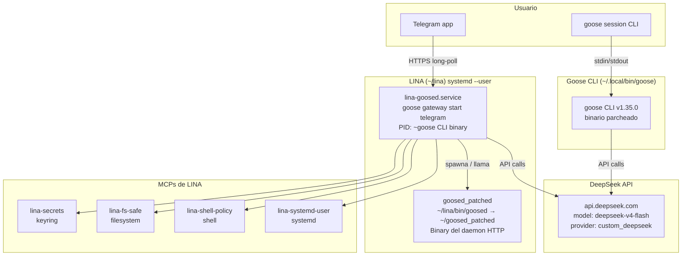
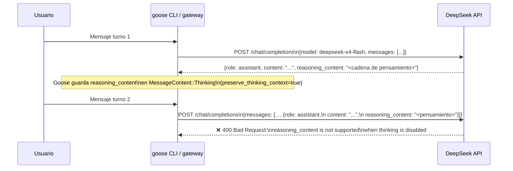
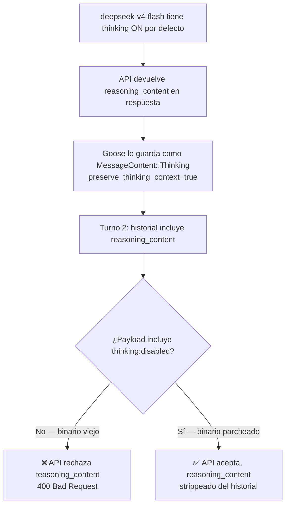
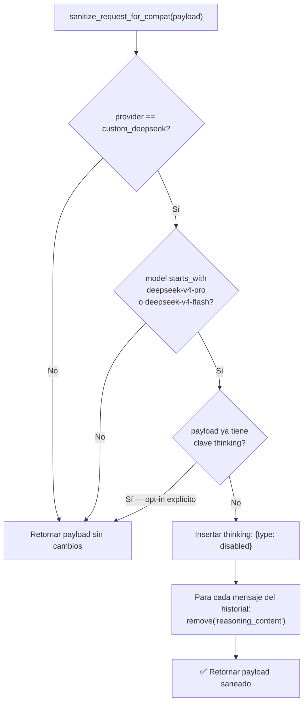
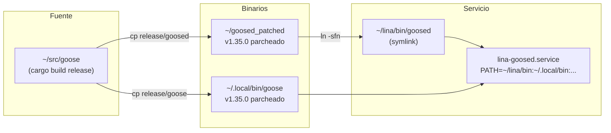
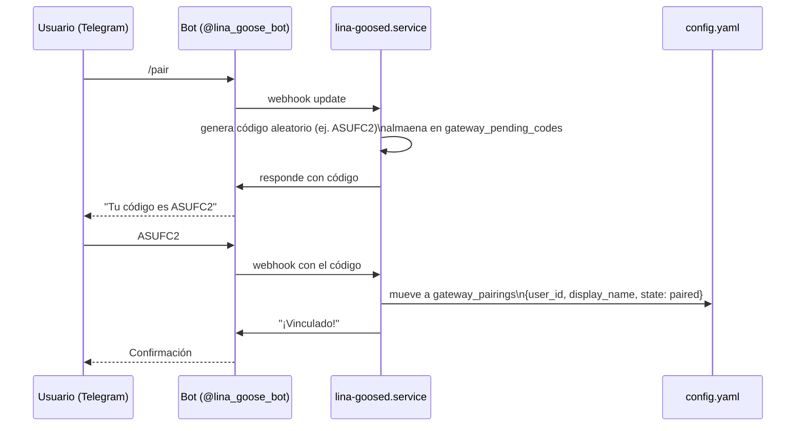

# Runbook 0001 — DeepSeek V4 `reasoning_content` 400 Error: Root Cause & Fix

**Fecha:** 2026-05-25  
**Estado:** ✅ Resuelto en producción  
**Servicios afectados:** `lina-goosed.service`, `goose session` (CLI interactivo)  
**Severidad:** Alta — bloquea toda conversación tras el primer turno en sesiones largas

---

## Tabla de contenidos

1. [Arquitectura del sistema](#1-arquitectura-del-sistema)
2. [Descripción del problema](#2-descripción-del-problema)
3. [Root Cause Analysis](#3-root-cause-analysis)
4. [La solución: `sanitize_request_for_compat`](#4-la-solución-sanitize_request_for_compat)
5. [Cómo compilar Goose desde fuente](#5-cómo-compilar-goose-desde-fuente)
6. [Deployment y reemplazo de binarios](#6-deployment-y-reemplazo-de-binarios)
7. [Telegram pairing: mantenimiento](#7-telegram-pairing-mantenimiento)
8. [Verificación y tests](#8-verificación-y-tests)
9. [Troubleshooting](#9-troubleshooting)
10. [Referencias](#10-referencias)

---

## 1. Arquitectura del sistema

### 1.1 Componentes principales



### 1.2 Binarios y sus roles

| Binario | Path | Rol | ¿Tiene el patch? |
|---------|------|-----|-----------------|
| `goose` CLI | `~/.local/bin/goose` | Sesiones interactivas, gateway | ✅ Sí (compilado 2026-05-25) |
| `goosed` daemon | `~/lina/bin/goosed` → `~/goosed_patched` | Servidor HTTP del gateway | ✅ Sí |
| Goose Desktop | `/usr/lib/goose/Goose` | App de escritorio (Electron) | ⚠️ No — binario del sistema |
| goosed Desktop | `/usr/lib/goose/resources/bin/goosed` | Daemon de la app de escritorio | ⚠️ No — binario del sistema |

> **Nota:** La app de escritorio usa sus propios binarios en `/usr/lib/goose/`. Si se requiere el patch ahí también, es necesario sobreescribir o usar `GOOSED_BINARY` env var en el lanzador `.desktop`.

### 1.3 Config principal

```
~/.config/goose/config.yaml          ← renderizado por `just apply-config`
~/lina/config/goose.config.yaml.tmpl ← template con variables ${...}
~/.config/goose/secrets.env          ← secretos (chmod 600, nunca en git)
```

---

## 2. Descripción del problema

### 2.1 Síntoma

Tras enviar un mensaje al bot de Telegram (o en `goose session`), la segunda respuesta (o cualquier respuesta posterior al primer turno con pensamiento activo) falla con:

```
Ran into this error: Request failed: Bad request (400):
The reasoning_content in the thinking mode must be passed back to the API.
```

O la variante inversa cuando el thinking se desactiva:

```
Ran into this error: Request failed: Bad request (400):
reasoning_content is not supported when thinking is disabled
```

### 2.2 Flujo que reproduce el error



---

## 3. Root Cause Analysis

### 3.1 Por qué DeepSeek V4 devuelve `reasoning_content`

`deepseek-v4-flash` y `deepseek-v4-pro` tienen **thinking activado por defecto**. Si no se envía explícitamente `{"thinking": {"type": "disabled"}}` en el payload, el API devuelve siempre un campo `reasoning_content` en cada respuesta del asistente.

### 3.2 Por qué Goose lo preserva en el historial

En `crates/goose/src/providers/openai.rs`, la función `format_messages_with_options` tiene:

```rust
preserve_thinking_context: !is_openai,  // true para custom_deepseek
```

Esto hace que Goose capture el `reasoning_content` como `MessageContent::Thinking` y lo reenvíe en el siguiente turno dentro del historial de mensajes.

### 3.3 Por qué el API lo rechaza en el segundo turno

DeepSeek rechaza el reenvío de `reasoning_content` **cuando thinking está desactivado**. Como el payload original no incluía `{"thinking": {"type": "disabled"}}`, el API alternó entre modos internamente y rechaza el `reasoning_content` histórico.

### 3.4 Árbol de causa-efecto



---

## 4. La solución: `sanitize_request_for_compat`

### 4.1 Descripción del patch

El patch fue implementado en `~/src/goose` (commit HEAD al 2026-05-25) en:

```
crates/goose/src/providers/openai.rs
```

### 4.2 Código del patch

```rust
/// DeepSeek V4 models have thinking mode ON by default. Inject `thinking:{type:disabled}`
/// when no explicit `thinking` key is present, so non-thinking operation works.
const DEEPSEEK_THINKING_DEFAULT_ON_MODELS: &[&str] =
    &["deepseek-v4-pro", "deepseek-v4-flash"];

fn sanitize_request_for_compat(&self, mut payload: serde_json::Value) -> serde_json::Value {
    if let Some(obj) = payload.as_object_mut() {
        if self.name == "custom_deepseek" {
            let model = obj.get("model").and_then(|m| m.as_str()).unwrap_or("");
            let is_v4 = Self::DEEPSEEK_THINKING_DEFAULT_ON_MODELS
                .iter()
                .any(|m| model.starts_with(m));
            let thinking_disabled = !obj.contains_key("thinking");
            if is_v4 && thinking_disabled {
                // 1. Inyectar thinking:disabled para que la API no active el modo razonamiento
                obj.insert(
                    "thinking".to_string(),
                    serde_json::json!({"type": "disabled"}),
                );
                // 2. Eliminar reasoning_content del historial — la API rechaza mensajes
                //    con reasoning_content cuando thinking está desactivado
                if let Some(messages) =
                    obj.get_mut("messages").and_then(|m| m.as_array_mut())
                {
                    for message in messages {
                        if let Some(map) = message.as_object_mut() {
                            map.remove("reasoning_content");
                        }
                    }
                }
            }
        }
        // ... resto de la función para otros providers
    }
    payload
}
```

### 4.3 Dónde se llama

```rust
// En la función send_request / complete (~línea 879):
let payload = self.sanitize_request_for_compat(payload);
```

### 4.4 Lógica del patch en diagrama



---

## 5. Cómo compilar Goose desde fuente

### 5.1 Prerrequisitos

```bash
# Rust toolchain (el proyecto usa rust-toolchain.toml)
rustup show   # verifica versión activa

# Dependencias de sistema (Ubuntu/Debian)
sudo apt install -y pkg-config libssl-dev libdbus-1-dev
```

### 5.2 Compilar `goosed` (daemon del gateway)

```bash
cd ~/src/goose
cargo build --release --bin goosed \
    --no-default-features \
    --features portable-default,system-keyring,code-mode
# ⚠️  NO incluir local-inference — requiere llama-cpp + clang y OOM en builds lentos
# Output: target/release/goosed (~280MB)
```

### 5.3 Compilar `goose` (CLI + gateway)

```bash
cd ~/src/goose
cargo build --release --bin goose \
    --no-default-features \
    --features portable-default,system-keyring,code-mode
# Output: target/release/goose (~264MB)
# Tiempo estimado: ~4-5 minutos en hardware normal
```

### 5.4 Features explicadas

| Feature | Descripción | ¿Incluir? |
|---------|-------------|-----------|
| `portable-default` | Configuración portable sin paths hardcodeados al sistema | ✅ Sí |
| `system-keyring` | Integración con libsecret/kwallet para secretos | ✅ Sí |
| `code-mode` | Habilita el modo Code para sesiones de programación | ✅ Sí |
| `local-inference` | Inference local con llama.cpp | ❌ No — requiere clang, OOM |

---

## 6. Deployment y reemplazo de binarios

### 6.1 Estrategia de reemplazo (bypass "Text file busy")

Cuando el servicio `lina-goosed.service` está corriendo, el kernel bloquea la sobreescritura directa del binario en uso. La solución es:

1. **Detener el servicio** (libera el lock del inode)
2. **Reemplazar el binario** con `cp`
3. **Reiniciar el servicio** (usa el nuevo inode)

> **Alternativa sin downtime:** `mv` el binario viejo fuera, luego `cp` el nuevo. Linux permite renombrar archivos en uso (solo cambia la entrada del directorio, el inode y proceso antiguo siguen usando el archivo original hasta que cierra).

### 6.2 Reemplazar `goose` CLI (con downtime mínimo)

```bash
# Opción A: Con detención del servicio (recomendado)
systemctl --user stop lina-goosed.service
cp -v ~/src/goose/target/release/goose ~/.local/bin/goose
~/.local/bin/goose --version   # verificar versión
systemctl --user start lina-goosed.service
sleep 3 && just status

# Opción B: Sin detener el servicio (mv + cp)
mv ~/.local/bin/goose ~/.local/bin/goose.old.$(date +%s)
cp ~/src/goose/target/release/goose ~/.local/bin/goose
chmod +x ~/.local/bin/goose
~/.local/bin/goose --version
# El servicio sigue usando el inode viejo hasta que reinicia
systemctl --user restart lina-goosed.service
```

### 6.3 Reemplazar `goosed` (daemon)

El symlink `~/lina/bin/goosed → ~/goosed_patched` permite actualizar apuntando a un nuevo binario:

```bash
# Copiar nuevo binario parcheado
cp ~/src/goose/target/release/goosed ~/goosed_patched2
chmod +x ~/goosed_patched2

# Actualizar symlink (atómico)
ln -sfn ~/goosed_patched2 ~/lina/bin/goosed

# Verificar
ls -la ~/lina/bin/goosed

# Reiniciar para que tome el nuevo binario
systemctl --user restart lina-goosed.service
sleep 3 && just status
```

### 6.4 Verificar que el patch está presente

```bash
# Funcional (mejor test):
goose session   # mandar 2 mensajes — si no hay 400, el patch está activo

# Estructural (buscar símbolo en el binario):
nm ~/.local/bin/goose 2>/dev/null | grep -i sanitize | head -5
# En build release con LTO el símbolo puede estar inlineado y no aparecer
# → confiar en el test funcional
```

### 6.5 Diagrama de deployment



---

## 7. Telegram pairing: mantenimiento

### 7.1 Cómo funciona el pairing



### 7.2 Config resultante tras pairing exitoso

```yaml
# ~/.config/goose/config.yaml
gateway_pairings:
  - platform: telegram
    user_id: '7966401870'
    display_name: Fede
    state:
      state: paired
      session_id: 20260526_3
      paired_at: 1779756298
gateway_pending_codes: []
```

### 7.3 Por qué se pierde el pairing

El comando `just apply-config` renderiza el config desde el template y puede sobreescribir `gateway_pairings`. Para evitarlo, el script `~/lina/bin/merge-config.py` **preserva** los campos `gateway_pairings` y `gateway_pending_codes` del config existente al hacer el merge.

> **Regla:** Siempre usar `just apply-config` y no editar `~/.config/goose/config.yaml` manualmente.

### 7.4 Re-parear si se pierde

```bash
# 1. Verificar estado actual
cat ~/.config/goose/config.yaml | grep -A 10 gateway_pairings

# 2. Si está vacío, iniciar servicio y enviar /pair en Telegram
just status

# 3. En Telegram: escribir /pair al bot
# El bot responderá con un código de 6 caracteres (ej. ASUFC2)

# 4. Responder al bot con ese código
# El bot confirmará el vinculado

# 5. Verificar que quedó guardado
cat ~/.config/goose/config.yaml | grep -A 10 gateway_pairings
# Debe mostrar state: paired
```

---

## 8. Verificación y tests

### 8.1 Checklist post-deployment

```bash
# 1. Versión del CLI
~/.local/bin/goose --version
# Esperado: 1.35.0 (o superior)

# 2. Estado del servicio
just status
# Esperado: active (running)

# 3. Provider wiring
goose info --check
# Esperado: custom_deepseek OK, model deepseek-v4-flash

# 4. Test funcional completo (enviar 3 mensajes seguidos en Telegram)
# Mensaje 1: "hola"
# Mensaje 2: "cuál es la capital de Francia"
# Mensaje 3: "y de Alemania"
# Si el tercer mensaje responde sin error 400 → ✅ patch activo

# 5. Config intacto (pairing preservado)
cat ~/.config/goose/config.yaml | grep "state: paired"
```

### 8.2 Tests unitarios del patch (en repo Goose)

```bash
cd ~/src/goose
cargo test -p goose -- sanitize_request --nocapture
# Los tests cubren:
# - deepseek-v4-flash sin thinking → se inyecta disabled + se stripea reasoning_content
# - deepseek-v4-pro sin thinking → mismo
# - deepseek-v4-flash con thinking explícito → no se modifica
# - otros modelos → no se modifica
```

---

## 9. Troubleshooting

### 9.1 "Text file busy" al reemplazar el binario

```
cp: cannot create regular file '/home/fede/.local/bin/goose': Text file busy
```

**Causa:** El kernel bloquea sobreescribir un binario en ejecución (el proceso `lina-goosed.service` tiene el inode abierto).

**Solución:**
```bash
# Detener servicio, reemplazar, reiniciar
systemctl --user stop lina-goosed.service
cp ~/src/goose/target/release/goose ~/.local/bin/goose
systemctl --user start lina-goosed.service
```

### 9.2 Servicio no arranca tras reemplazo

```bash
journalctl --user -u lina-goosed.service -n 50 --no-pager
# Buscar: EnvironmentFile not found → revisar que ~/.config/goose/secrets.env existe
# Buscar: Permission denied → chmod +x ~/.local/bin/goose
```

### 9.3 El pairing se perdió tras `just apply-config`

```bash
# Verificar que merge-config.py está funcionando
cat ~/lina/bin/merge-config.py

# Si el problema es que el script no existe o falla, el workaround manual es:
# 1. Copiar el bloque gateway_pairings del backup
cat ~/.config/goose/config.yaml.bak.<timestamp> | grep -A 20 gateway_pairings
# 2. Re-parear manualmente (ver sección 7.4)
```

### 9.4 Build falla por falta de `clang` o `llvm`

```
error: failed to run custom build command for `llama-cpp-sys`
```

**Causa:** Se incluyó la feature `local-inference` accidentalmente.

**Solución:**
```bash
# Asegurarse de usar SOLO estas features:
cargo build --release --bin goose \
    --no-default-features \
    --features portable-default,system-keyring,code-mode
# ⚠️ Sin local-inference
```

### 9.5 DeepSeek 401 Unauthorized

```bash
# Verificar API key
grep DEEPSEEK_API_KEY ~/.config/goose/secrets.env
# Si está vacía: just secrets-init para regenerar
```

---

## 10. Referencias

| Recurso | URL / Path |
|---------|-----------|
| Patch en openai.rs | `~/src/goose/crates/goose/src/providers/openai.rs` líneas 520-557 |
| PR que introduce el patch | Commits en `~/src/goose` al 2026-05-25 |
| Config template | `~/lina/config/goose.config.yaml.tmpl` |
| Systemd unit | `~/lina/deploy/systemd/lina-goosed.service` |
| Justfile (comandos) | `~/lina/justfile` |
| ADR Clean Architecture | `~/lina/docs/architecture/0001-clean-architecture.md` |
| Goose build docs | `~/src/goose/BUILDING_LINUX.md` |
| DeepSeek API docs | https://platform.deepseek.com/api-docs |

---

## Apéndice A — Variables de entorno clave

| Variable | Valor actual / Default | Descripción |
|----------|----------------------|-------------|
| `DEEPSEEK_API_KEY` | En `secrets.env` | API key de DeepSeek |
| `TELEGRAM_BOT_TOKEN` | En `secrets.env` | Token del bot de Telegram |
| `GOOSE_PROVIDER` | `custom_deepseek` | Provider activo |
| `GOOSE_MAX_TURNS` | Config template | Máximo de turnos por sesión |
| `GOOSE_GATEWAY_MAX_TURNS` | Config template | Máximo de turnos en gateway |
| `GOOSE_THINKING_EFFORT` | `false` (en config) | Control de thinking (no parsea como enum válido → efectivamente `None`) |
| `GOOSED_BINARY` | (no seteado) | Override del binario goosed; el PATH resuelve `~/lina/bin/goosed` |

## Apéndice B — Historial de binarios

| Fecha | Binario | Hash / Versión | Notas |
|-------|---------|----------------|-------|
| Pre-2026-05-25 | `~/.local/bin/goose` | `1.35.0-canary+728d72a` | **Sin patch** — causaba el error |
| 2026-05-25 | `~/.local/bin/goose` (nuevo) | `1.35.0` compilado desde HEAD | **Con patch** — en producción |
| 2026-05-25 | `~/goosed_patched` | compilado previo | **Con patch** — en producción vía symlink |
| Backup | `~/.local/bin/goose.bak.1779757594` | `1.35.0-canary+728d72a` | Backup del binario viejo |
